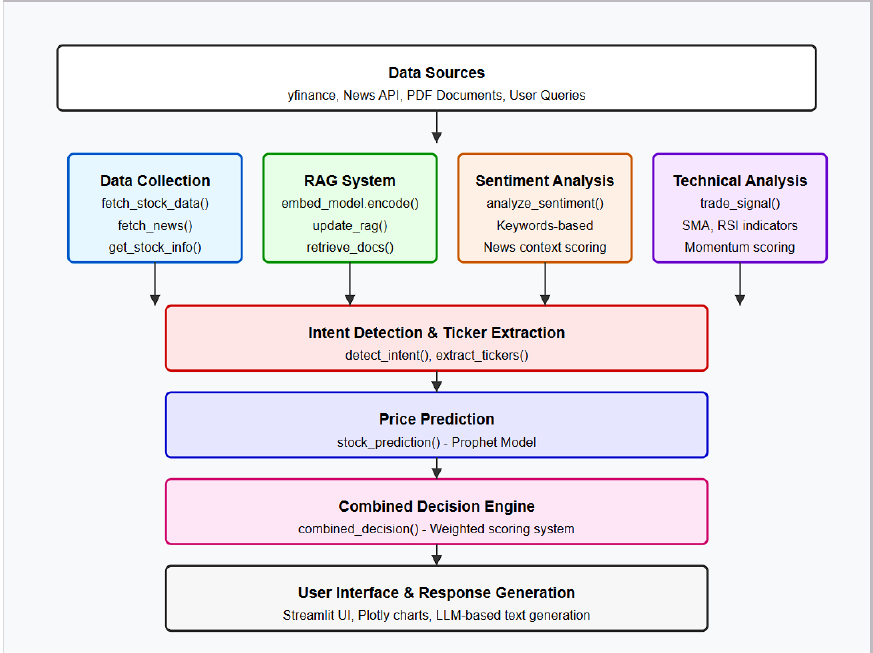

# README.md

## 📈 AI Financial Assistant - LLM-Driven Market Analysis & Trading System

An interactive Streamlit-based AI assistant for Indian stock analysis, recommendations, and forecasting using hybrid AI methods (RAG + rule-based + time-series forecasting).

---

## 🧠 System Architecture



---

## ⚙️ Setup & Deployment

### 🐍 Prerequisites

* Python ≥ 3.8
* pip packages:

  ```bash
  pip install streamlit yfinance prophet faiss-cpu sentence-transformers
  pip install plotly pandas requests nltk spacy pdfplumber transformers
  ```

### 🚀 Run Locally

```bash
git clone https://github.com/your-repo/ai-financial-assistant.git
cd ai-financial-assistant
streamlit run Main.py
```

### 📁 Folder Structure

```
Main.py                     # Main Streamlit app
EQUITY_L.csv                # NSE equity list
Market_reference.pdf        # Financial reference document
```

---

## 🧰 Toolkit Comparison

| Component          | Tool Used      | Alternatives            |
| ------------------ | -------------- | ----------------------- |
| UI Framework       | Streamlit      | Flask, Gradio           |
| Data Fetching      | yfinance       | Alpha Vantage, Quandl   |
| Sentiment Analysis | Rule-based NLP | FinBERT, VADER, LLaMA   |
| Forecasting        | Prophet        | ARIMA, LSTM, XGBoost    |
| Document Retrieval | FAISS + ST     | ElasticSearch, Pinecone |
| LLM (demo)         | GPT-2 (HF)     | GPT-3.5, Claude, LLaMA  |

---

## 📊 Performance Benchmarks

| Feature                 | Result / Observation                         |
| ----------------------- | -------------------------------------------- |
| Forecast Accuracy       | \~21% drop predicted for TATAMOTORS.NS (30d) |
| Sentiment Scoring Speed | <1s per document                             |
| News Fetch Interval     | Every 15 minutes via threaded updater        |
| Stock Comparison        | Returns score-weighted recommendation        |
| FAISS Search            | Real-time <500ms for top-3 results           |

For questions or contributions, please open an issue or pull request.
